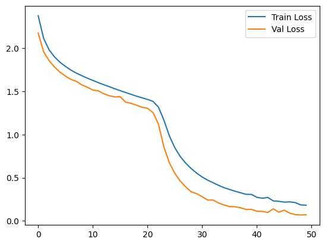
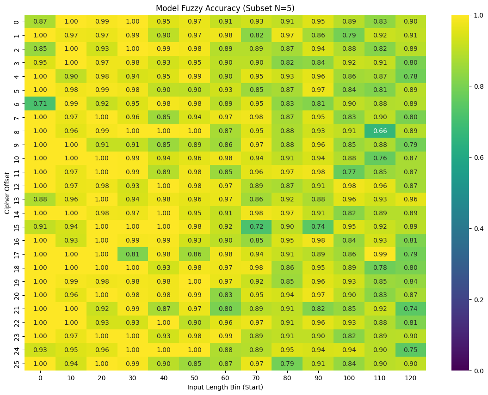
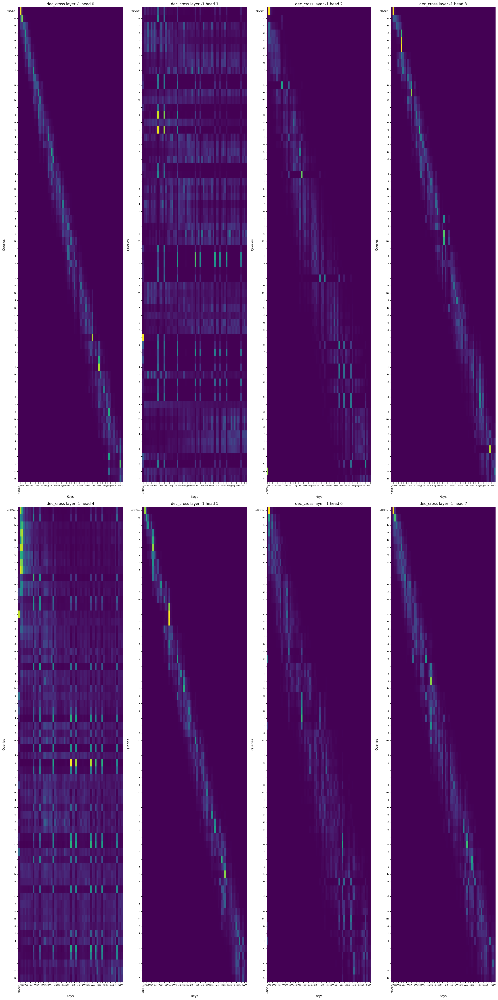

# Deciphering Caesar Cipher with Transformers

This project explores using a Sequence-to-Sequence (Seq2Seq) Transformer model to decipher text encoded with the Caesar cipher. The model takes the ciphered text and the shift offset as input and learns to reconstruct the original plain text.

## Project Overview

The core experiment is contained in the `training_cipher_model.ipynb` notebook. The workflow includes:

1.  **Data Acquisition & Preparation**: Downloads a dataset of simple ciphers, filters for alphanumeric characters, and generates synthetic cipher-text pairs using variable offsets.
2.  **Model Architecture**: A custom Transformer model (`Seq2SeqCipherTransformer`) designed to handle character-level sequence transduction. It uses cross-attention to attend to the encrypted input while generating the decrypted output.
3.  **Training**: The model is trained to minimize the reconstruction loss between the predicted text and the original filtered text.
4.  **Visualization & Interpretability**: The notebook includes detailed visualizations of the training process and the model's internal attention mechanisms.

## Key Results

### Training Convergence
The model successfully converges, with both training and validation loss decreasing over epochs.

### Model Performance
We analyze the model's performance across different cipher offsets and sequence lengths to ensure robustness.

### Attention Mechanisms
One of the most interesting aspects of this project is visualizing the cross-attention maps. The diagonal patterns in the attention heads (e.g., heads 0, 3, 5, 7) indicate that the model has learned the positional relationship between the cipher text and the plain text—effectively "looking" at the corresponding character in the input to decipher the output.

## Getting Started

1.  **Install Dependencies**: Ensure you have Python installed along with `torch`, `pandas`, `matplotlib`, `seaborn`, and `requests`.
2.  **Run the Notebook**: Open `training_cipher_model.ipynb` in Jupyter or VS Code to step through the data generation, training, and evaluation process.
3.  **Pre-trained Model**: The notebook saves the trained model weights to `seq2seq_cipher_transformer.pth`.

## Repository Structure

- `training_cipher_model.ipynb`: The main notebook for training and evaluation.
- `cipher_decipher_dataset.jsonl`: The raw dataset (downloaded by the notebook).
- `cleaned_cipher_data.csv`: Preprocessed dataset used for training.
- `seq2seq_cipher_transformer.pth`: Saved model state dictionary.
